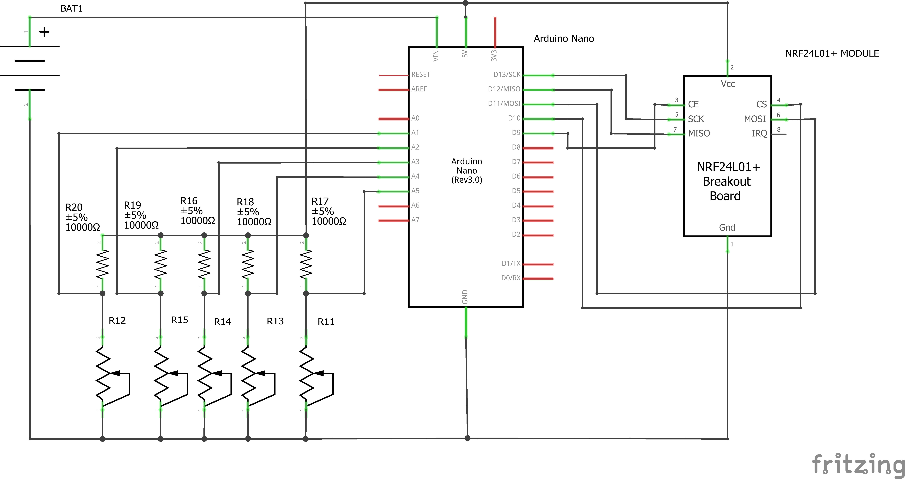
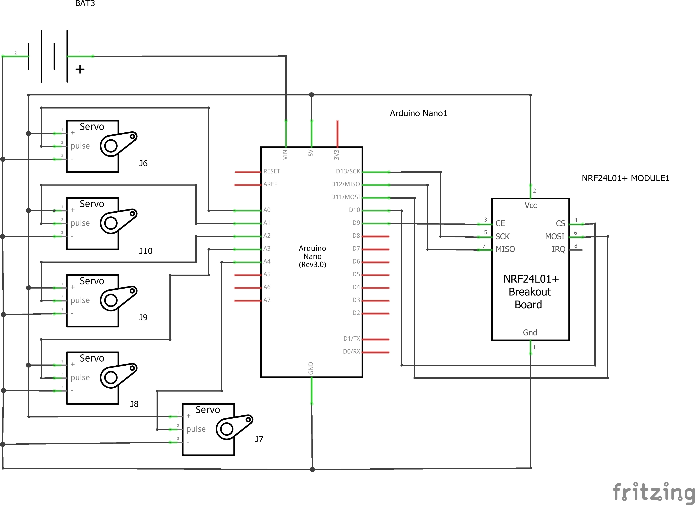

# 🤖 Robotic Hand Project

A wireless gesture-controlled robotic hand built with Arduino, flex sensors, and NRF24L01 radio modules. A glove fitted with flex sensors captures hand movements and transmits them wirelessly to a 3D-printed robotic hand, which mirrors the gestures in real time via servo motors.

Originally developed as an open-source prosthetic research platform.

---

## 📸 Demo


---

## ✨ Features

- Real-time wireless gesture control via NRF24L01 (250KBPS, ~100m range)
- 5-finger articulation using MG996R servo motors
- Flex sensor glove for intuitive hand tracking
- Per-finger calibration support
- Simple, hackable codebase — easy to extend

---

## 🛠️ Materials

| Component | Quantity | Link |
|---|---|---|
| Arduino Uno or Mega | 2 | [Amazon](https://a.co/d/7hcBaU4) |
| NRF24L01+ wireless module | 2 | [Amazon](https://a.co/d/2pLEXYt) |
| Flex sensors | 5 | [Amazon](https://a.co/d/0HHEU9b) |
| MG996R servo motors | 5 | [Amazon](https://a.co/d/9qywIPb) |
| 10k Ohm resistors | 5 | [Amazon](https://a.co/d/1EXjHHf) |
| LiPo 7.4V / NiMH 7.2V battery | 1 | [Amazon](https://a.co/d/2NYQ9gW) |
| Fish wire (for finger tendons) | — | [Amazon](https://a.co/d/iEQPEsA) |
| Glue gun | 1 | [Amazon](https://a.co/d/2u9a7ZK) |
| Jumper wires | — | [Amazon](https://a.co/d/2u9a7ZK) |

---

## 🗺️ Schematics

### Transmitter (Glove)



| Pin | Connection |
|---|---|
| A1 - A5 | Flex sensors |
| 9, 10 | NRF24L01 CE, CSN |

### Receiver (Robotic Hand)



| Pin | Connection |
|---|---|
| 2 - 6 | Servo motors |
| 9, 10 | NRF24L01 CE, CSN |

> ⚠️ Power the NRF24L01 modules from the **3.3V pin only** — they are not 5V tolerant.

---

## 🖨️ 3D Model

The hand structure is sourced from [Viral Science](https://www.viralsciencecreativity.com/post/arduino-flex-sensor-controlled-robot-hand). Print files are available in the [`hardware/`](hardware/) folder.

Print settings:
- Material: PLA or PETG
- Infill: 20–30%
- Supports: Yes (for finger joints)

---

## ⚙️ Setup

### 1. Clone the repository
```bash
git clone https://github.com/SoloScriptSage/robotic-hand-project.git
```

### 2. Install Arduino libraries
In Arduino IDE go to **Sketch → Include Library → Manage Libraries** and install:
- `RF24` by TMRh20
- `Servo` (built-in)

### 3. Assemble the hardware
- Print and assemble the 3D hand following the Viral Science instructions
- Attach servos to fingers and run fish wire as tendons
- Wire flex sensors to the glove according to the transmitter schematic
- Wire servos to the receiver board according to the receiver schematic

### 4. Calibrate the flex sensors
Flash [`firmware/test_sensors/test_sensors.ino`](firmware/test_sensors/test_sensors.ino) to the transmitter Arduino. Open Serial Monitor at **9600 baud**. For each finger:
1. Hold the finger **flat** — record the value
2. Bend the finger **fully** — record the value

Update `FLEX_MIN` and `FLEX_MAX` in `transmitter.ino` with your recorded values:
```cpp
const int FLEX_MIN[5] = {535, 535, 535, 535, 535}; // flat
const int FLEX_MAX[5] = {680, 680, 680, 680, 710}; // fully bent
```

### 5. Flash the firmware
- Flash [`firmware/transmitter/transmitter.ino`](firmware/transmitter/transmitter.ino) to the **glove Arduino**
- Flash [`firmware/receiver/receiver.ino`](firmware/receiver/receiver.ino) to the **hand Arduino**

### 6. Test servos
Before full assembly, flash [`firmware/servo_test/servo_test.ino`](firmware/servo_test/servo_test.ino) to the receiver Arduino to verify all 5 servos sweep correctly.

---

## 💻 Code Overview

| File | Description |
|---|---|
| `transmitter.ino` | Reads flex sensors, maps to servo angles, transmits via NRF24L01 |
| `receiver.ino` | Receives data, writes angles to servo motors |
| `test_sensors.ino` | Prints raw flex sensor values for calibration |
| `servo_test.ino` | Sweeps all servos 0→180→0 for hardware testing |

---

## 🧪 Testing


1. Power both Arduinos
2. Open Serial Monitor on the transmitter — you should see `Sensors: 90 90 90 ...`
3. Open Serial Monitor on the receiver — you should see `Received: 90 90 90 ...`
4. Flex your fingers — values should change and servos should respond

---

## 🚀 Roadmap

- [ ] Per-finger calibration via Serial Monitor wizard
- [ ] Haptic feedback on glove (vibration motors)
- [ ] NRF24L01 external antenna for extended range
- [ ] Replace flex sensors with IMU-based gesture recognition
- [ ] Full prosthetic enclosure design
- [ ] Support for wrist rotation (6th servo)

---

## 🙏 Acknowledgments

- [Viral Science](https://www.viralsciencecreativity.com/post/arduino-flex-sensor-controlled-robot-hand) for the 3D hand model
- [TMRh20](https://github.com/nRF24/RF24) for the RF24 library
- The open-source Arduino community

---

## 📄 License

This project is open-source under the [MIT License](LICENSE).
